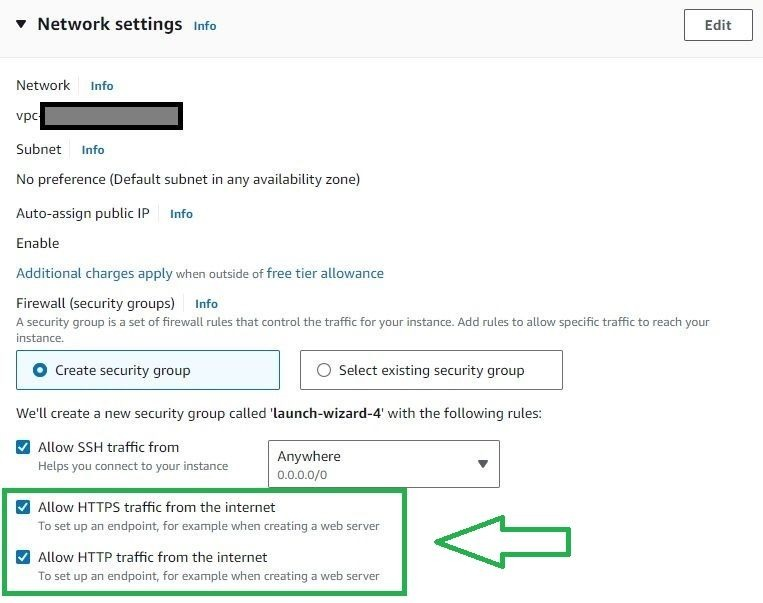
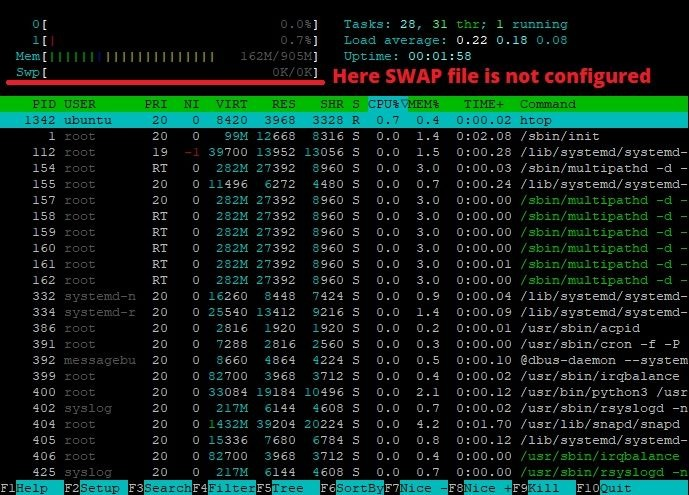
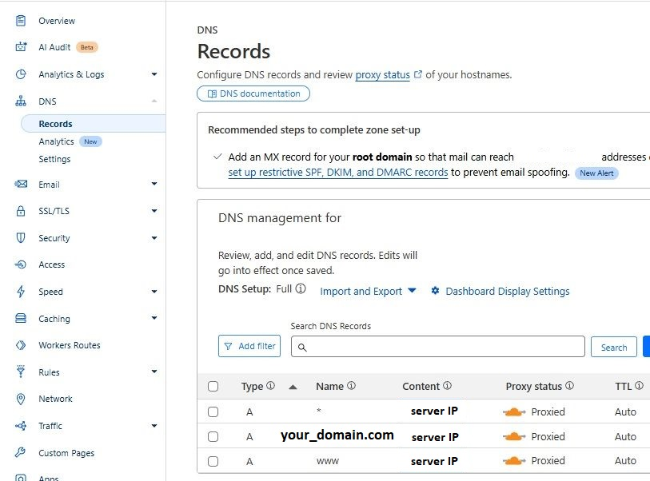
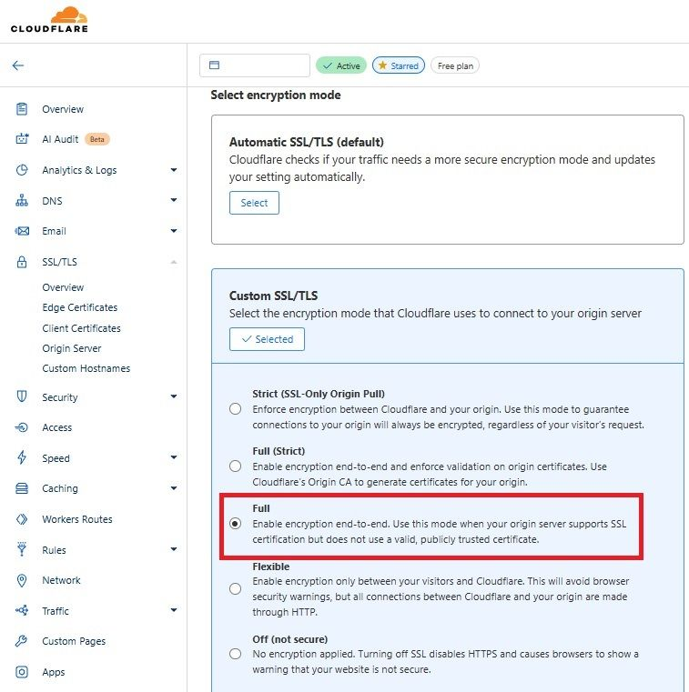

This is a [Next.js](https://nextjs.org/) project bootstrapped with [`create-next-app`](https://github.com/vercel/next.js/tree/canary/packages/create-next-app).

## Getting Started

First, run the development server:

```bash
npm run dev
# or
yarn dev
# or
pnpm dev
# or
bun dev
```

Open [http://localhost:3000](http://localhost:3000) with your browser to see the result.

You can start editing the page by modifying `app/page.tsx`. The page auto-updates as you edit the file.

This project uses [`next/font`](https://nextjs.org/docs/basic-features/font-optimization) to automatically optimize and load Inter, a custom Google Font.

## Learn More

To learn more about Next.js, take a look at the following resources:

- [Next.js Documentation](https://nextjs.org/docs) - learn about Next.js features and API.
- [Learn Next.js](https://nextjs.org/learn) - an interactive Next.js tutorial.

You can check out [the Next.js GitHub repository](https://github.com/vercel/next.js/) - your feedback and contributions are welcome!

## Deploy on Vercel

The easiest way to deploy your Next.js app is to use the [Vercel Platform](https://vercel.com/new?utm_medium=default-template&filter=next.js&utm_source=create-next-app&utm_campaign=create-next-app-readme) from the creators of Next.js.

Check out our [Next.js deployment documentation](https://nextjs.org/docs/deployment) for more details.


=============================================================================


## Deploy on AWS EC2
**#1 Create AWS EC2 free tier instance (I'm using Ubuntu 22.04 LTS).**\

**#2 Enable incoming traffic via port 80 and 443 via AWS account manager during EC2 creation process**\


**#3.0 check current RAM and SWAP file using command:**\
`htop`
if SWAP is 0 then you need to create it. This will reduce the CPU load for the data when RAM is full because when an instance runs out of RAM linux will try to write data into SWAP but you don't have one and it will constantly try to do it again and again... It will cause a huge CPU overload...

**Example of NOT configured SWAP file in the system:**\


**#3.1 Create SWAP file which is 2-3 times bigger than your RAM using this command set for Ubuntu Server:**\
`sudo fallocate -l 4G /swapfile; sudo chmod 600 /swapfile; sudo mkswap /swapfile; sudo swapon /swapfile; free -h; sudo cp /etc/fstab /etc/fstab.bak; echo '/swapfile none swap sw 0 0' | sudo tee -a /etc/fstab; sudo sysctl vm.swappiness=10;`


**#4 Login to AWS EC2 terminal using SSH and enter these commands to install Nginx web server:**\
`sudo apt update`\
`sudo apt install nginx`

**NOTE: replace your_domain with your actual domain name.**\

**#5.0 Create directory for *your_domain* (replace it with your real domain name) as follows:**\
`sudo mkdir -p /var/www/your_domain/html`

**#5.1 change permissions for this directory recursively**\
`sudo chmod -R 755 /var/www/your_domain`

**#6 Next, assign ownership of the directory with the `$USER` environment variable:**\
`sudo chown -R $USER:$USER /var/www/your_domain/html`

**#7 Set permissions on this directory:**\
`sudo chmod -R 755 /var/www/your_domain`

**#8 In order for Nginx to serve this content, it’s necessary to create a server block with the correct directives.**\
Instead of modifying the default configuration file directly, let’s make a new one at **/etc/nginx/sites-available/your_domain**:\
`sudo nano /etc/nginx/sites-available/your_domain`

**#9 Paste in the following configuration block, which is similar to the default, but updated for our new directory and domain name:**\
```
server {
        listen 80;
        listen [::]:80;

        root /var/www/your_domain/html;
        index index.html index.htm index.nginx-debian.html;

        server_name your_domain www.your_domain;

        return 301 https://$server_name$request_uri;
}

server {
     listen 443;
     listen [::]:443;

     server_name your_domain www.your_domain;

     root /var/www/your_domain/html;

     #ssl_certificate /etc/letsencrypt/live/example.com/fullchain.pem;
     #ssl_certificate_key /etc/letsencrypt/live/example.com/privkey.pem;
     #include snippets/ssl-params.conf;

     location / {
          # reverse proxy for next server
          proxy_pass http://localhost:3000;
          proxy_http_version 1.1;
          proxy_set_header Upgrade $http_upgrade;
          proxy_set_header Connection 'upgrade';
          proxy_set_header Host $host;
          proxy_cache_bypass $http_upgrade;

          # we need to remove this 404 handling
          # because next's _next folder and own handling
          # try_files $uri $uri/ =404;
     }

     location ~ /.well-known {
          allow all;
     }
}

```
Notice that we’ve updated the root configuration to our new directory, and the server_name to our domain name.


**#10 Now, let’s enable the file by creating a link from it to the sites-enabled directory, which Nginx reads from during startup:**\
`sudo ln -s /etc/nginx/sites-available/your_domain /etc/nginx/sites-enabled/`

**#11 check Nginx config for syntax errors**\
`sudo nginx -t`

**#12 if everything is ok then restart the Nginx server**\
`sudo systemctl restart nginx`


**#13.0 IF you use CloudFlare you need to configure A records:**\


**#13.1 IF you use CloudFlare you need to enabe FULL SSL encryption: ( otherwise it will cause ERR_TOO_MANY_REDIRECTS )**\



**#14 Install certbot to use Let's Encrypt free SSL certificates:**\
`sudo apt install certbot python3-certbot-nginx`

**#15 Execute this command to create and install SSL for YOUR_DOMAIN:**\
`sudo certbot --nginx -d YOUR_DOMAIN`


**#16 Install latest version of Node.js**\
[Commands from "Install Node.js documentation"](https://nodejs.org/en/download/package-manager)\
`curl -o- https://raw.githubusercontent.com/nvm-sh/nvm/v0.40.0/install.sh | bash`

`source ~/.bashrc`

`nvm list-remote`

**#17 Find the latest LTS version of the node available and install it using command like this:**\
`nvm install v22.11.0`

##### verify the right Node.js version is in the environment
`node -v ` # should print `v22.11.0`

#####  verify the right npm version is in the environment
`npm -v` # should print `10.9.0`


**#18 Install PM2 (the process manager for Node.js applications).**\
PM2 basically manages applications (run them in the background as a service). 
So this is how we install PM2 globally:
`npm install -g pm2`

**#19 navigate your terminal to your current project directory:**\
`cd PROJECT_DIRECTORY`

**#20.0 IF you cloning existing project then place files in current directory and run command:**\
`npm install`
it will install all the Node.js related dependencies.

**#20.1 IF you're starting a new project then you can install Next.js starter project using command:**\
`npx create-next-app@latest ./`
./ means that we create this Next.js project inside our current directory

**#21 Before creating pm2 daemon we need to have a build of our project, otherwise it will cause an error:**\
```log
[Error: ENOENT: no such file or directory, open '/var/www/YOUR_DOMAIN/html/.next/BUILD_ID'] {
errno: -2,
code: 'ENOENT',
syscall: 'open',
path: '/var/www/YOUR_DOMAIN/html/.next/BUILD_ID'
}
```

**#22 create the latest build for your project:**\
`npm run build`

**#23 create ecosystem.config.js file at the root of the Node.js project, this is the config to run app via pm2. File will contain these code: (replace CURRENT_PROJECT with your current project name to properly show up at the pm2 status panel)**\
```
module.exports = {
apps : [{
  name: "CURRENT_PROJECT",
  script: "npm",
  args: "start",
  cwd: "./",
  watch: true,
  watch_delay: 2000,
  // watch_options: {
  //   usePolling: true,
  //   // interval: 2000,
  // },
  env: {
    NODE_ENV: "production",
    PORT:3000,
  }
}]
};
```

**#24 run command to start process manager if you've created ecosystem.config.js file:**\
`pm2 start`


**#25 OPTIONAL. IF you don't want to use config file then you can simply start your application using pm2 on port 3000**\
`pm2 start "npm run start -- -p 3000" --name YOU_APP_NAME`


